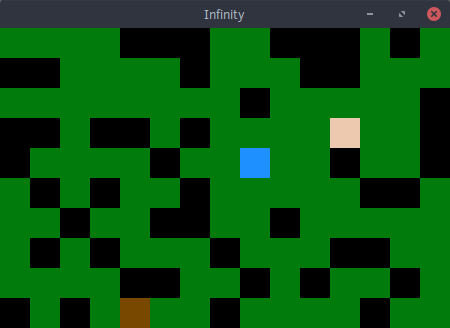

# Infinity

## Description

Infinity is a game that allows a player to move around in a randomly generated 2D world that infinitely scrolls to the right. The arrow keys control the player (in blue), which can only move on the floor (grass - green, sand - tan, dirt - brown). A mouse click creates or removes walls (in black), while a mouse drag moves walls.

This project was written in C++ using [GLUT](https://www.opengl.org/resources/libraries/glut/) and [OpenGL](https://www.opengl.org/) for an Advanced Programming Class at the [University of Vermont](https://uvm.edu). It is free and open source under the [GPL-3.0 license](LICENSE).

 
**Note**: We are using the [filesystem](http://en.cppreference.com/w/cpp/experimental/fs) library from the yet unreleased C++17 (as of writing), thus, some platforms require special configuration when building. Please follow the instructions below for your system. 

-----

## Building
**Linux:** Install GLUT, OpenGL, and gcc (version 6.3), then run the following in the project directory: `g++ -std=c++17 -lGL -lglut main.cpp gameboard.cpp block.cpp player.cpp wall.cpp floor.cpp testing.cpp gameboard_tests.cpp block_tests.cpp player_tests.cpp wall_tests.cpp floor_tests.cpp gui.cpp -o infinity -lstdc++fs`

**Windows:** Use Visual Studio 2017 with GLUT and OpenGL installed. Make sure you add the directories containing GLUT and OpenGL to Visual Studio's library paths.

**Mac:** As the current version of Clang used by Xcode doesn't seem to support C++17 yet, you need to use Homebrew to install gcc (version 6.3), GLEW, and OpenGL, then run the following in the project directory (with the newly downloaded gcc): `g++ -std=c++17 -framework OpenGL -framework GLUT main.cpp gameboard.cpp block.cpp player.cpp wall.cpp floor.cpp testing.cpp gameboard_tests.cpp block_tests.cpp player_tests.cpp wall_tests.cpp floor_tests.cpp gui.cpp -o infinity -lstdc++fs`